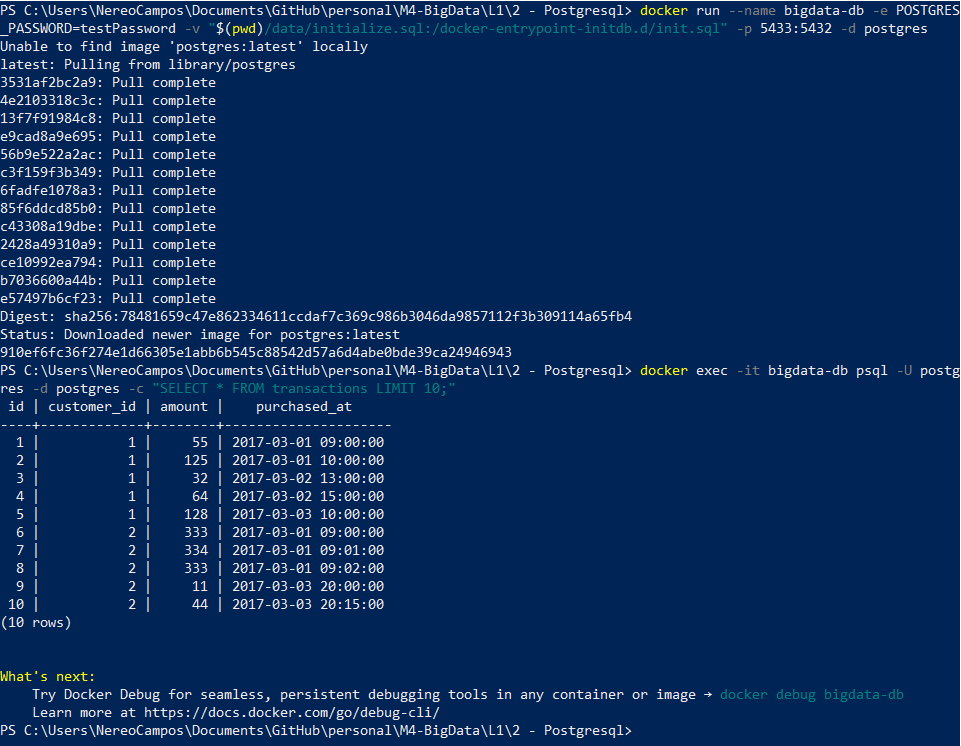

# To run PostgreSQL, execute:

```bash
docker rm bigdata-db

docker run --name bigdata-db -e POSTGRES_PASSWORD=testPassword -v "$(pwd)/data/initialize.sql:/docker-entrypoint-initdb.d/init.sql" -p 5433:5432 -d postgres
  ```

# To verify it is working, execute:

```bash
docker exec -it bigdata-db psql -U postgres -d postgres -c "SELECT * FROM transactions LIMIT 10;"
```

The output should be:

<p align="center">
  
</p>