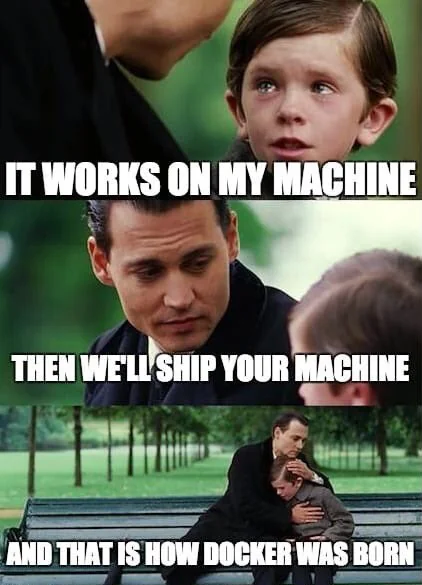

# Ambiente basado en Devcontainers para el curso de Big Data

Contribuido por Diego Dompe & David Ramirez

## FAQ

### ¿Que es un container?
Los containers son un mecanismo para empaquetar ambientes completos de Linux, todas sus dependencias. Esto es útil para crear ambientes que funcionan entre diversas máquinas.



### ¿Que es un devcontainer?

os comandos y workflows alrededor de docker estan orientados a empaquetar y correr aplicaciones, pero no son tan amigables para el proceso de desarrollo y experimentación:

- Requiere varios comandos para "ingresar" al ambiente de desarrollo
- El manejo de los permisos es complicado

Devcontainer es un standard que nació para simplificar la vida de los desarrolladores que quieren usar containers como su ambiente de desarrollo: https://containers.dev

Los devcontainers son soportados por [muchas herramientas de desarrollo](https://containers.dev/supporting).


### ¿No puedo hacer lo mismo con virtual environment de Python?
Parcialmente: Los virtual environments de Python permiten administrar un conjunto de paquetes de python en una versión especifica, y funcionan en cualquier sistema operativo. Sin embargo no pueden controlar dependencias que no son de Python.

En el caso de trabajos que requieren usar herramientas basadas en Java (como Spark), y que son especificas a Linux (como Spark), los containers permiten manejar esas dependencias.

## Pre-requisitos

- Tener un ambiente de docker instalado y funcional
- Visual Studio Code con la siguientes extensiones instaladas:
    - ms-vscode-remote.remote-containers (aka `Dev Containers`)
    - ms-toolsai.jupyter (aka `Jupyter`)


## Que incluye este repositorio

- Los materiales del curso de Big Data
- Un Dockerfile modificado para funcionar tanto en procesadores compatibles con Intel o con ARM (Apple Silicon)
- Un .devcontainer/devcontainer.json que configura adecuadamente cualquier herramienta compatible con devcontainers para usar el contenedor

## Como usar el devcontainer con Visual Studio Code

- Abrar el este repositorio en Visual Studio Code y use la paleta de comandos para correr `Dev Containers: Reopen in container`

> [!NOTE]
> Es posible que el mismo VSCode detecte que hay un devcontainer y le pregunté si desea re-abrir el directorio con el devcontainer.

Asumiendo que su ambiente de docker funciona correctamente, esto causará que VSCode corra los comandos para construir el container usando las instrucciones del Dockerfile (puede ver los logs para ver el avance, dura unos minutos). Finalmente re-abrirá la ventana "dentro" del devcontainer y en la esquina inferior izquierda va a decir en color azul: `Dev Container: Big Data`

La terminal de visual studio tendrá configurado adecuadamente el ambiente de Python. Se puede verificar rápidamente corriendo:

```bash
cd "L1/1 - Basic-Container/basic"
spark-submit read.py
```

La salida deberá ser:

```bash
+---+-----------+
| id|       name|
+---+-----------+
|  1| Juan Perez|
|  2|Maria Lopez|
+---+-----------+
```

### Corriendo Jupyter Notebooks

VSCode puede abrir los archivos `.ipynb` directamente sin necesidad de correr el servidor de Jupyter.

Para probar, abra el archivo `L1/3 - Full-Container/notebook-example/Spark_DataFrames_API.ipynb`

De click en `Select Kernel` -> `Python Environments...` -> `venv (3.10.12) (Python 3.10.12) /opt/venv/bin/python`

Ahora debería poder correr las celdas

### Corriendo containers que no son de desarrollo

Durante los ejercicios a veces se solicita correr algunos containers que son el que usamos para desarollo, por ejemplo el de postgresql para cargar datos. Para poder hacer esto "dentro" del devcontainer, hemos incluido docker-in-docker dentro del mismo, esto permite correr un docker dentro del un container que ya esta corriendo docker.


Para probar esto puede correr los ejercicios de la primera lección:

```bash
cd "L1/2 - Postgresql"

docker run --name bigdata-db -e POSTGRES_PASSWORD=testPassword -v "$(pwd)/data/initialize.sql:/docker-entrypoint-initdb.d/init.sql" -p 5433:5432 -d postgres

docker exec -it bigdata-db psql -U postgres -d postgres -c "SELECT * FROM transactions LIMIT 10;"
```

Produce el output:
```
 id | customer_id | amount |    purchased_at     
----+-------------+--------+---------------------
  1 |           1 |     55 | 2017-03-01 09:00:00
  2 |           1 |    125 | 2017-03-01 10:00:00
  3 |           1 |     32 | 2017-03-02 13:00:00
  4 |           1 |     64 | 2017-03-02 15:00:00
  5 |           1 |    128 | 2017-03-03 10:00:00
  6 |           2 |    333 | 2017-03-01 09:00:00
  7 |           2 |    334 | 2017-03-01 09:01:00
  8 |           2 |    333 | 2017-03-01 09:02:00
  9 |           2 |     11 | 2017-03-03 20:00:00
 10 |           2 |     44 | 2017-03-03 20:15:00
(10 rows)
```

Ademas, el panel izquierdo de VSCode les provee un panel de containers que les permite ver que tienen corriendo e inpeccionar logs o archivos.